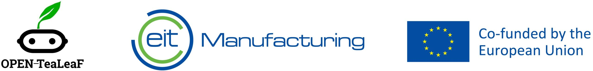
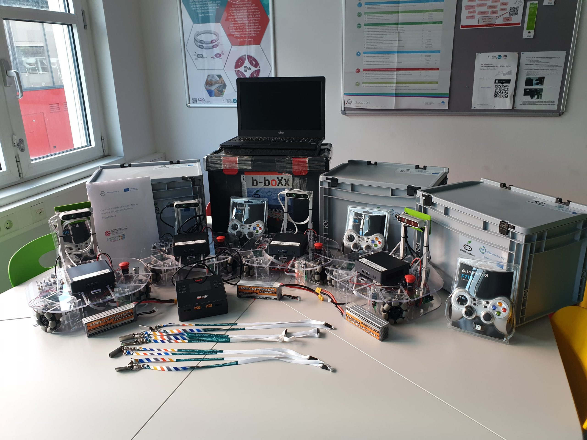

# OPEN-TeaLeaF

# ABOUT THE PROJECT

The purpose of the “OPEN-TeaLeaF” project is to design portable and open teaching and learning kits (TeaLeaF kits). The kits make expensive equipment accessible to learners and promote hands-on learning experiences. By promoting time-sharing of robotic equipment, hundreds of pupils in Estonia and Austria can be engaged with a relatively conservative number of physical devices. “OPEN-TeaLeaF” conducts teacher workshops to ensure the didactic foundation empowers teachers to use the kits in their classes.

[OPEN-TeaLeaF WEBSITE](https://open-tealeaf.eu/)

The OPEN-TeaLeaF activity is supported by EIT Manufacturing co-funded by the European Union.

# PROJECT DOCUMENTATION

## Learning kit contents

|  |  |
|:---:|:---:|
| OPEN-TeaLeaF kits (Type-EE) | OPEN-TeaLeaF kits (Type-AT) |

The learning kit consists of the following components:

- ROBOTONT, an open-source mobile robot for education and research
- Game controller for teleoperating the robot
- Batteries for the robot
- Charger for the robot’s battery
- Power supply cable
- USB memory stick that contains the pre-installed software
- Markers for enabling vision-based perception
- Small traffic cones for marking the area of application

To ensure the scalability of OPEN-TeaLeaF kits, the components are either completely open-sourced (preferred) or low-cost off-the-shelf products with many functional alternatives.
The specific brand or a model for component that is included in an OPEN-TeaLeaF kits is not necessarily strictly defined as long as the intended functionality is still maintained. For that reason, there are minor differences in the Bill of Materials for kits created in Austria (Type-AT) and Estonia (Type-EE). The table below provides an overview of the TeaLeaF kit final BoM and possible variations.

<table>
  <thead>
    <tr>
      <th><strong>OPEN-TeaLeaF kit functional component</strong></th>
      <th><strong>Specific design or product used in Austria (Type-AT)</strong></th>
      <th><strong>Specific design or product used in Estonia (Type-EE)</strong></th>
    </tr>
  </thead>
  <tbody>
    <tr>
      <td>Mobile robot</td>
      <td>Robotont gen2</td>
      <td>Robotont gen3</td>
    </tr>
    <tr>
      <td>Gamepad for teleoperating the robot</td>
      <td>Logitech F710 wireless gamepad</td>
      <td>IPEGA 9129 Black Bluetooth Gamepad Digital</td>
    </tr>
    <tr>
      <td>Batteries for the robot</td>
      <td>Turnigy High Capacity 5200mAh 4S 12C Lipo Pack w/XT60</td>
      <td>18V LXT® Lithium-Ion 5.0Ah Battery</td>
    </tr>
    <tr>
      <td>Battery charger</td>
      <td>K2 Air Dual Charger 200 (500)W x2 AC/DC 1-6S</td>
      <td>Makita 18V LXT® Lithium-Ion Rapid Optimum Charger</td>
    </tr>
    <tr>
      <td>USB flash drive with pre-installed software</td>
      <td>Kingston 3D TLC, 64 GB</td>
      <td>SAMSUNG FIT PLUS 64GB USB 3.1</td>
    </tr>
    <tr>
      <td>Fiducial marker for vision-based perception</td>
      <td colspan="2">Design files: <a href="assets/ar_steering_wheel.pdf" data-type="attachment" data-id="255" target="_blank" rel="noreferrer noopener">ar_steering_wheel.pdf</a></td>
    </tr>
    <tr>
      <td>Cones for marking the area of application</td>
      <td colspan="2">Design files:  <a href="assets/open-tealeaf_kit_cone.SLDPRT" target="_blank" rel="noreferrer noopener nofollow">SolidWorks</a> | <a href="assets/open-tealeaf_kit_cone.STEP" target="_blank" rel="noreferrer noopener">STEP</a> | <a href="assets/open-tealeaf_kit_cone.STL" target="_blank" rel="noreferrer noopener">STL</a></td>
    </tr>
    <tr>
      <td>Box</td>
      <td>EuroBox 25.6L, 400 x 300 x 270 mm</td>
      <td>PRO BOX storage box (32L), 510 x 390 x 250 mm</td>
    </tr>
  </tbody>
</table>

## Additional resources

Robotont landing page at the University of Tartu: [robotont.ut.ee](http://robotont.ut.ee)

The software for operating with the kit is organized [under Robotont account on GitHub](https://github.com/robotont/)

[Gamepad pairing instructions](docs/gamepad_pairing.md)

Full documentation (including the bill of materials and the steps for assembly) of the 2nd generation Robotont is published in a research paper at HardwareX: [doi.org/10.1016/j.ohx.2023.e00436](http://doi.org/10.1016/j.ohx.2023.e00436)

## Online learning content on Skills.move platform

*Free registration on [skillsmove.eu](https://www.skillsmove.eu/) is required to access the following learning content.

  
[EN] Robotont – An Open Source Mobile Robot For Education And Research

  * [Robotont – open-source mobile robot for education and research](https://www.skillsmove.eu/course/view.php?id=4141)
  * [Robotont – components](https://www.skillsmove.eu/course/view.php?id=4771)
  * [Robotont – omni-directional wheels](https://www.skillsmove.eu/course/view.php?id=323)
  * [Robotont – sensors](https://www.skillsmove.eu/course/view.php?id=322)

  
[ET] Robotont – Avatud Mobiilne Robot Õppe- Ja Teadustööks

  * [Robotont – avatud robotplatvorm hariduses ja teaduses](https://www.skillsmove.eu/course/view.php?id=1607)
  * [Robotont – komponendid](https://www.skillsmove.eu/course/view.php?id=4297)
  * [Robotont – omni-suunalised rattad](https://www.skillsmove.eu/course/view.php?id=4298)
  * [Robotont – tajurid](https://www.skillsmove.eu/course/view.php?id=4299)

  
[DE] Robotont – mobiler Open-Source-Roboter für Bildung und Forschung

  
  * [Robotont – mobiler Open-Source-Roboter für Bildung und Forschung](https://www.skillsmove.eu/course/view.php?id=4261)

# PARTNERS

## University of Tartu – leading partner

UT includes four faculties. To support and develop the professional competence of its students and academic staff, the university has entered into bilateral co-operation agreements with 79 partner institutions in 31 countries.

University of Tartu (UT) is Estonia’s leading centre of research and training. It preserves the culture of the Estonian people and spearheads the country’s reputation in research and provision of higher education. UT belongs to the top 1.2% of world’s best universities.

As Estonia’s national university, UT stresses the importance of international co-operation and partnerships with reputable research universities all over the world. The robust research potential of the university is evidenced by the fact that the University of Tartu has been invited to join the Coimbra Group, a prestigious club of renowned research universities.

UT includes four faculties. To support and develop the professional competence of its students and academic staff, the university has entered into bilateral co-operation agreements with 79 partner institutions in 31 countries.

## OCG Austrian Computer Society

The Austrian Computer Society (OCG) is a non-profit association for the promotion of information technology with due regard to the interaction with people and society. The association acts as an interdisciplinary forum for the latest IT topics, it is an important and respected dialogue partner and has thematic leadership for socio-political IT topics.

The OCG acts as a networking forum, it is a competent and reliable partner for event organisation and that way promotes the relationship between science and business. Moreover, it offers standardised, independent and high-quality IT education and training thus building an important bridge to the working world.

## JOANNEUM RESEARCH

JOANNEUM RESEARCH, headquartered in Graz, is a successful national and internationally active research institution owned by the Austrian federal states of Styria, Carinthia and Burgenland. Ideally embedded in the national and international innovation network, our researchers innovate in three high-level fields of expertise: “[Information and Production Technologies](https://www.joanneum.at/en/informations-und-produktionstechnologien)”, “[Human Technologies and Medicine](https://www.joanneum.at/en/humantechnologie-und-medizin)”, and “[Society and Sustainability](https://www.joanneum.at/en/gesellschaft-und-nachhaltigkeit)”. They use ideas, innovative power and considerable research experience to support companies both private and public not only with the development of technology, methods and products, but also with societal topics.

