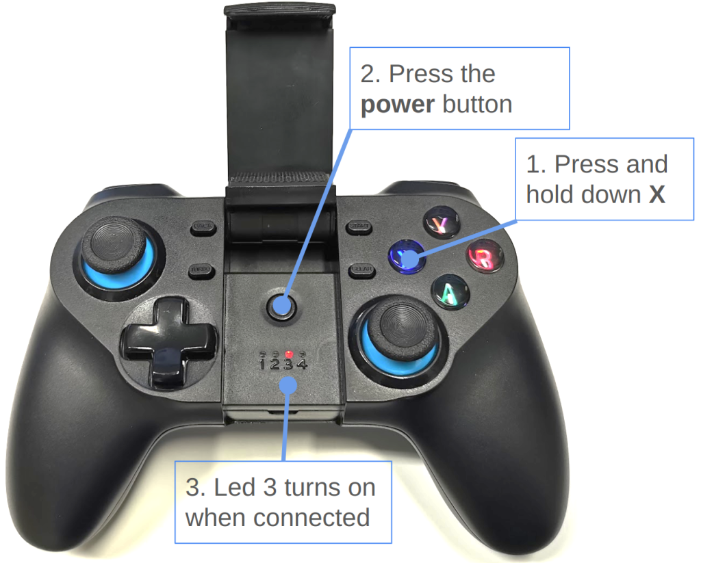
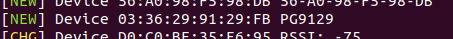
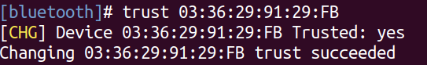
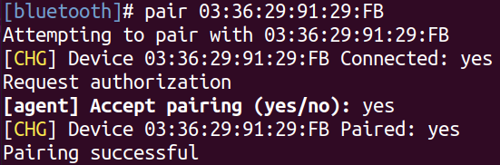

# IPEGA PG-9129 gamepad pairing

## Setting the gamepad into Bluetooth mode

1. Open the center lid of the gamepad

1. Press simultaneously X and the power button on the gamepad for about 2 seconds

1. The LED 3 should blink, indicating that the gamepad has been set to the standard Bluetooth mode

## Pairing the gamepad with the Robotont

In order to use the gamepad with the Robotont we have to first pair the gamepad with the robot. In the following, we demonstrate two methods of how to achieve that.

### Option 1: Using a graphical interface

This method is convenient if you have a monitor and a mouse hooked up to the robot.

1. Go to: Settings -> Bluetooth

1. Click on the IPEGA9120

1. Click the "Pair" button

### Option 2: Using a command line interface

Use this method if you are accessing the robot over the network.

1. Log in to the robotont via ssh  
    `ssh peko@robotont-1`

1. Enter the Bluetooth interactive shell 
    `bluetoothctl`

1. Next, we need a MAC address of our gamepad

    1. For Robotont kits, the addresses are marked on the bottom of the gamepad.

    1. If you don't know the address use the scan on command and look for the newly appeared device named PG9129 once you turn the gamepad on. To turn off the scanning mode enter scan off

    

1. Trust the device (replace XX with the MAC address of your gamepad)
    `trust XX:XX:XX:XX:XX:XX`

    

1. Pair the device (replace XX with the MAC address of your gamepad):
    `pair XX:XX:XX:XX:XX:XX`

    Answer yes to the authorization request

    

1. Connect to the device (replace XX with the MAC address of your gamepad):
pair XX:XX:XX:XX:XX:XX

Well done! You should now have the gamepad successfully paired. To exit the Bluetooth shell and ssh you can enter twice the command: `exit`

